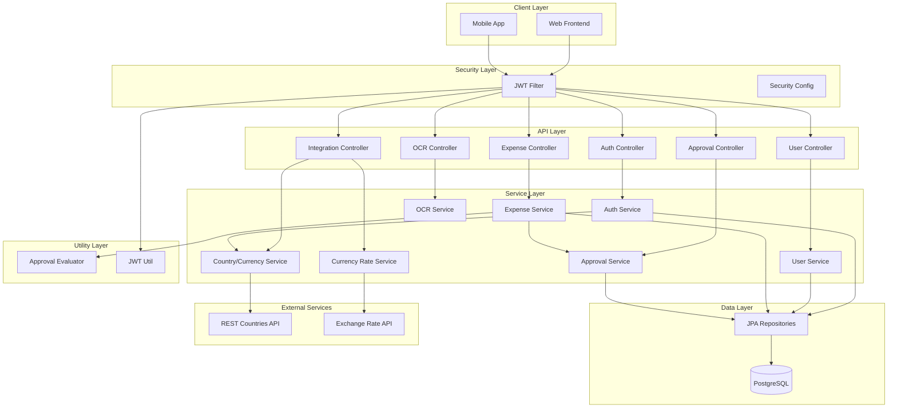

# System Architecture

## Overview

The Expense Management Backend is a Spring Boot REST API that handles employee expense submissions, multi-step approval workflows, and integrations with external services for currency data.

## Architecture Diagram



## Component Descriptions

### 1. Client Layer
- **Web Frontend**: Browser-based UI (React, Angular, Vue, etc.)
- **Mobile App**: iOS/Android native or hybrid app
- **Communication**: REST API with JWT authentication

### 2. API Layer (Controllers)
RESTful endpoints handling HTTP requests/responses:
- **AuthController**: Signup, login, JWT generation
- **UserController**: User management (create, list, roles)
- **ExpenseController**: Expense submission and retrieval
- **ApprovalController**: Approval workflow operations
- **OcrController**: Receipt image parsing
- **IntegrationController**: External API proxies (countries, rates)

### 3. Security Layer
- **JWT Filter**: Intercepts requests, validates JWT tokens, sets authentication context
- **Security Config**: Configures Spring Security (endpoints, CORS, password encoding)
- **JWT Util**: Token generation, validation, and claims extraction

### 4. Service Layer (Business Logic)
- **AuthService**: User registration, login, company creation
- **UserService**: User CRUD operations, role assignment
- **ExpenseService**: Expense submission, approval workflow initiation
- **ApprovalService**: Approval step management, decision processing
- **OcrService**: Receipt OCR (stub with mock data)
- **CountryCurrencyService**: Country/currency lookup (external API + fallback)
- **CurrencyRateService**: Exchange rate fetching (external API + fallback)

### 5. Utility Layer
- **ApprovalEvaluator**: Rule evaluation logic for determining approvers
  - Percentage-based rules
  - Specific approver rules
  - Hybrid rules
  - Manager-first logic

### 6. Data Layer
- **JPA Repositories**: Spring Data JPA interfaces for database access
- **PostgreSQL**: Relational database with ACID guarantees
- **Flyway**: Database migration and versioning

### 7. External Services
- **REST Countries API**: Country and currency data
- **Exchange Rate API**: Real-time currency exchange rates
- **Fallback**: Mock data when external APIs are unavailable

## Data Model

### Entity Relationships

```
Company
  |
  ├─── Users (1:N)
  |      |
  |      ├─── Manager (self-reference)
  |      └─── Expenses (1:N)
  |             |
  |             └─── ApprovalSteps (1:N)
  |                    |
  |                    └─── Approver (User)
  |
  └─── CompanyApprovalRules (1:N)
         |
         └─── SpecificApprover (User)
```

### Key Entities

1. **Company**: Organization with currency and approval settings
2. **AppUser**: User with role (Admin, Manager, Employee) and manager relationship
3. **Expense**: Expense submission with amount, category, status
4. **ApprovalStep**: Single step in approval workflow with decision
5. **CompanyApprovalRule**: Configurable approval rules for company

## Authentication Flow

```
1. User sends credentials to /api/auth/login
2. AuthService validates credentials
3. JwtUtil generates JWT token
4. Token returned to client
5. Client includes token in Authorization header
6. JwtFilter validates token on each request
7. SecurityContext populated with user details
8. Controller methods execute with authenticated user
```

## Expense Submission & Approval Flow

```
1. Employee submits expense
   ↓
2. ExpenseService creates Expense entity (status: PENDING)
   ↓
3. Fetch CompanyApprovalRules
   ↓
4. ApprovalEvaluator determines approvers
   - Check IS_MANAGER_APPROVER flag
   - Evaluate rules by sequence
   - Apply percentage, specific, or hybrid logic
   ↓
5. Create ApprovalSteps for each approver
   ↓
6. Expense saved with pending approval steps
   ↓
7. Manager/Admin views pending approvals
   ↓
8. Manager/Admin approves or rejects
   ↓
9. ApprovalService updates ApprovalStep
   ↓
10. Check if all steps approved or any rejected
    ↓
11. Update Expense status (APPROVED/REJECTED)
```

## Security Architecture

### Authentication
- **JWT Bearer Tokens**: Stateless authentication
- **BCrypt Password Hashing**: Secure password storage
- **CSRF Disabled**: Not needed for stateless JWT auth

### Authorization
- **Role-Based**: Admin, Manager, Employee
- **Method-Level Security**: `@PreAuthorize` annotations
- **Endpoint Protection**:
  - Public: `/api/auth/**`, `/api/integration/**`
  - Protected: All other endpoints require authentication

### CORS
- Configurable allowed origins (default: `http://localhost:3000`)
- Supports all HTTP methods (GET, POST, PUT, DELETE)
- Credentials allowed for authentication

## API Design Principles

1. **RESTful**: Resource-oriented URLs (`/api/expenses`, `/api/approvals`)
2. **Stateless**: No server-side sessions
3. **JSON**: Request/response bodies in JSON format
4. **Validation**: Jakarta Bean Validation on DTOs
5. **Error Handling**: HTTP status codes (200, 401, 403, 404, 500)

## Deployment Architecture (Production)

```
[Load Balancer]
       |
[API Instance 1]  [API Instance 2]  [API Instance N]
       |                |                  |
       +----------------+------------------+
                        |
              [PostgreSQL Cluster]
                   (Primary + Replicas)
```

### Production Considerations
- **Horizontal Scaling**: Stateless design allows multiple instances
- **Database**: Connection pooling (HikariCP), read replicas
- **Caching**: Add Redis for session/rate limiting (future)
- **Monitoring**: Prometheus metrics, health checks
- **Logging**: Centralized logging (ELK stack, Datadog)

## Technology Stack Summary

| Layer             | Technology                          |
|-------------------|-------------------------------------|
| Language          | Java 21                             |
| Framework         | Spring Boot 3.5.6                   |
| Security          | Spring Security + JWT (jjwt 0.11.5) |
| Database          | PostgreSQL 12+                      |
| ORM               | Spring Data JPA (Hibernate)         |
| Migrations        | Flyway                              |
| Build Tool        | Maven 3.8+                          |
| Testing           | JUnit 5, Spring Test, Mockito       |
| API Documentation | OpenAPI 3.0 (see api.yaml)          |

## Key Design Patterns

1. **Repository Pattern**: Data access abstraction via Spring Data JPA
2. **Service Layer Pattern**: Business logic separation from controllers
3. **DTO Pattern**: Request/response objects separate from entities
4. **Strategy Pattern**: ApprovalEvaluator for different rule types
5. **Filter Pattern**: JwtAuthenticationFilter for request interception
6. **Builder Pattern**: Entity construction (via Lombok)

## Scalability & Performance

### Current Limits
- **No Pagination**: All queries return full results
- **No Caching**: Every request hits the database
- **Synchronous**: Blocking I/O for external APIs

### Future Optimizations
1. Add pagination with Spring Data's `Pageable`
2. Implement caching (Redis, Caffeine) for:
   - User details
   - Company rules
   - Currency rates
3. Make external API calls async with WebClient
4. Add database indexing for frequently queried fields
5. Implement query optimization with JPA fetch strategies

## Monitoring & Observability

### Recommended Setup
1. **Metrics**: Spring Boot Actuator + Prometheus
2. **Logging**: Logback with JSON format → ELK stack
3. **Tracing**: OpenTelemetry or Zipkin
4. **Alerts**: Grafana dashboards for error rates, latency

### Key Metrics to Track
- Request latency (p50, p95, p99)
- Error rates by endpoint
- Database connection pool usage
- JWT validation failures
- External API response times

## Conclusion

The architecture follows Spring Boot best practices with clear separation of concerns. The design is:
- **Modular**: Easy to add new features (notifications, reporting)
- **Testable**: Services isolated with dependency injection
- **Scalable**: Stateless design allows horizontal scaling
- **Maintainable**: Standard patterns and conventions

The MVP scope focuses on core functionality while maintaining flexibility for future enhancements like multi-tenancy, real-time notifications, and advanced reporting.
